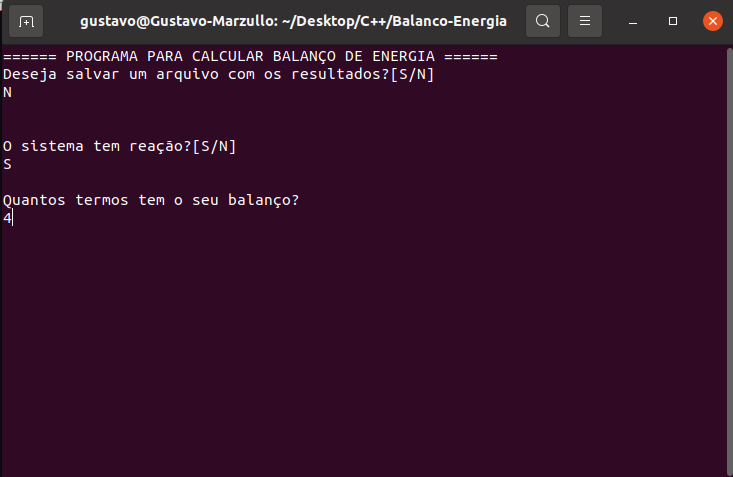
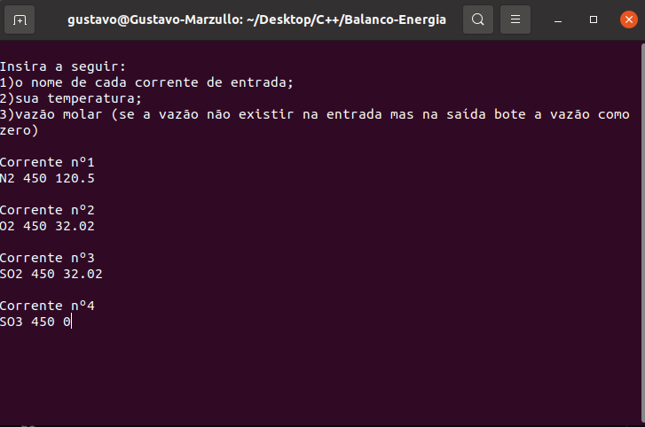
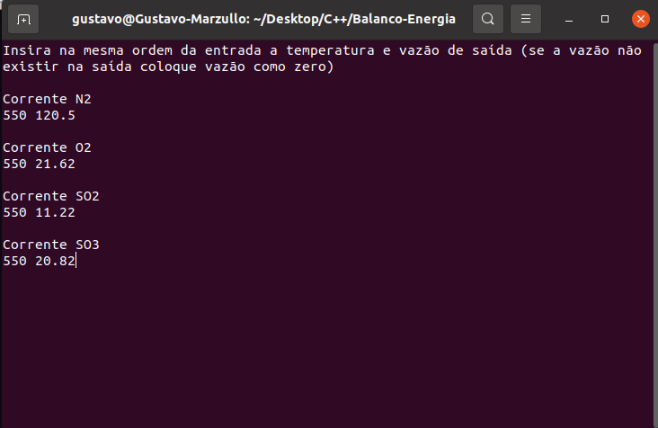
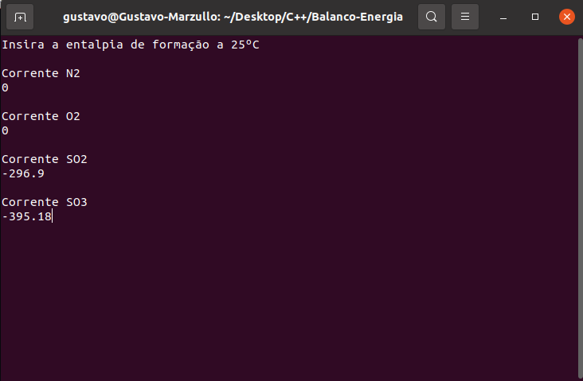
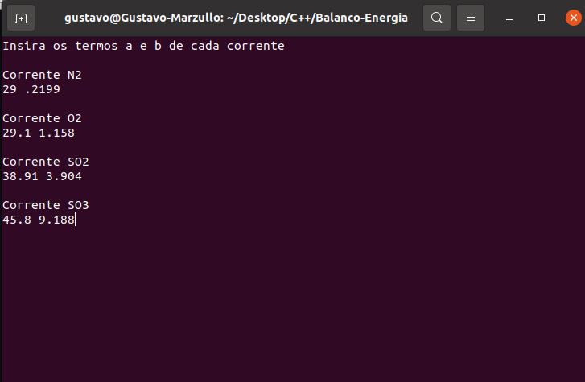
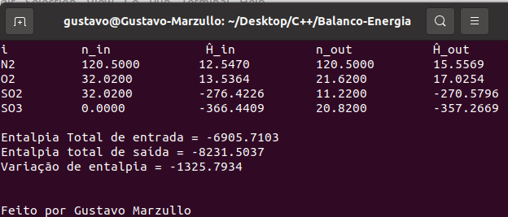

# Balanço de energia 

#### Referência das constantes de capacidade calorífica e entalpia de formação: Elementary Principles of Chemical Processes, 4 th Edition, 2016, by Felder and Rousseau. John Wiley & Sons.

Código para calcular um balanço de energia em sistema permanente. O programa calcula tanto em sistemas reativos quanto não reativos.

O programa toma como base um estado de referência a 25ºC e que não há mudança de pressão e no estado da matéria. Caso haja mudança no estado da matéria (Ex.: etanol indo de 20ºC a 150ºC) basta usar as constantes de Cp para a fase gasosa e proceder normalmente com os cálculos. 

Caso esteja no Windows e o cmd aprensente problemas no display de caracteres: https://stackoverflow.com/questions/57131654/using-utf-8-encoding-chcp-65001-in-command-prompt-windows-powershell-window

## Exemplo de ultilização

__Entrada do reator(450ºC):__ 120,5 mol/s de N2; 32,02 mol/s de O2; 32,02 mol/s de SO2

__Saída do reator(550ºC):__ 120,5 mol/s de N2; 21,62 mol/s de O2; 11,22 mol/s de SO2; 20,82 mol/s de SO3

### 1º Passo: Declarar o tipo de processo

### 2º Passo: Inserir as correntes de entrada

### 3º Passo: Inserir as correntes de saída

### 4º Passo: Inserir as entalpias de formação (caso o processo seja reativo)

### 5º Passo: Inserir os valores de capacidade calorífica

### 6º Passo: Display de resultados
;

